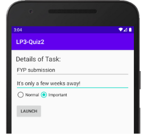

# Practical Quiz for Learning Package 3

This document outlines the information of the Practical Quiz.

This repository contains the skeleton code for the quiz.

### Structure of the quiz
There are 2 parts to this quiz, to be released at different timing:

1. After lesson 6
2. After lesson 7


### Content of the quiz (Part 2 - released after Lesson 7)

#### Prelude

In the world of open source, there are many public repositories hosted in GitHub, waiting for someone to contribute.

To contribute to a public repository, the access rights to it determines the methods:

| Scenario | Description                                                                         |Access rights                   |
|:---------|:------------------------------------------------------------------------------------|:-------------------------------|
| 1        | a contributor (meaning you are added to the repository to be a contributing member) |Granted write access to the repo|
| 2        | a good samaritan, wanted to contribute to the repo on an adhoc basis                |No write access granted to repo |

This, Part 2, is based on the 1st scenario where you have write access to a repository (public or private repo doesn't really matter once you are a contributing member - termed as collaborator in GitHub).

#### The App

This private repository contains an incomplete Android app project. You are required to complete this app, as shown below.

Basically, it is a simple data entry form, as shown below:


Upon clicking of the button, a broadcast will be sent to a Broadcast Receiver to launch a notification.

There will be 2 types of observable Notifications to be launched by the App, as listed below:

| Type | Data entered           | Outcome                |
|:-----|:-----------------------|:-----------------------|
| 1    |  |  |
| 2    |  |  |


#### How to start it off?

1. Upon acceptance of the assignment via GitHub Classrooms, you have the private repository set up and henceforth, you shall be known as the "owner".
2. Choose a collaborator among your teammates (one lucky person will do). Furnish the details in the table below.

>(You get to practice how to modify a README.md in MarkDown. Don't know where is the file, switch to "Project" view.)
>
>
>| Type         | Name                      | Student ID               |
>|:-------------|:--------------------------|:-------------------------|
>| Owner        | < Your name here >        | < Your ID >              |
>| Collaborator | < Another person's name > | < Another person's ID >  |
>

4. Add your teammate as a collaborator in this repo. Do remember to ask him to accept your invitation, otherwise he/she couldn't see this private repo.
5. Once this is done, proceed with the tasks below:

>
>| Type         | Tasks                               |
>|:-------------|:-----------------------------------------|
>| Owner        | 1. Checkout your repo using Android Studio.<br>2. Proceed to write necessary code to implement the logic as described except the Broadcast Receiver.<br>3. Commit and push as necesary.<br>4. Merge Pull Request (whenever the collaborator creates one) into the repo's main branch (using web browser).<br>5. Perform Git Update on your Android Studio project to reflect the changes form the repo.<br>6. Run it on your emulator to make sure the final outcome works! |
>| Collaborator | 1. Checkout the owner's repo using Android Studio.<br>2. Create a branch and implement the Broadcast Receiver.<br>3. Commit and push to the created branch and to the owner's repository.<br>4. Create Pull Request (at the GitHub site using your web browser) when you're done.                   |
>

6. As a good practice, check if the push is successful, using a web browser (here: https://github.com/C347-2020/LP3-OwnerXXXX)

```
Note: If you happen to mess up your repository, you can inform your lecturer to recreate your repo for you.
      You need to be a collaborator to someone's repo!
```

#### Resources:

- https://www.androidauthority.com/github-git-tutorial-995047/ (This is a good read, overview on Git & GitHub)
- https://www.youtube.com/playlist?list=PLlNpLMtnWblDyU14hzp40Fa6ZKDJ9UJsJ
- https://help.github.com/en/github/collaborating-with-issues-and-pull-requests/creating-a-pull-request-from-a-fork


### Requirement for submission

You are to work on the designated repository (in which, this is the one).

You are required to push your code into your repository regularly and GitHub will do the necessary code tracking.

| Parts                       | Deadline                                                       |
|:----------------------------|:---------------------------------------------------------------|
| Lesson 6 - LP Quiz 3 Part 1 | Tasks completed before Lesson 7                                |
| Lesson 7 - LP Quiz 3 Part 2 | Pushed into repository by 2359 of the following day of Lesson7 |

In any case, the deadline for the overall quiz submission is 2359 of the following day of Lesson 7.


## Plagiarism Warning

In essence, what you submit is your own work, without help from others in anyway (unless cited in the submission).

Refer to the link below, if you need more info.  
<http://intranet.rp.edu.sg/sites/StudentHandbook/SitePages/summative_assessment_rules_and_regulations.aspx>


## Academic Integrity

#### Writing Code


Writing code is similar to academic writing in that <b>when you use or adapt code developed by someone else as part of your project, you must cite your source.</b> However, instead of quoting or paraphrasing a source, you include an inline comment in the code. These comments not only ensure you are giving proper credit, but help with code understanding and debugging.

Src: https://integrity.mit.edu/handbook/writing-code


